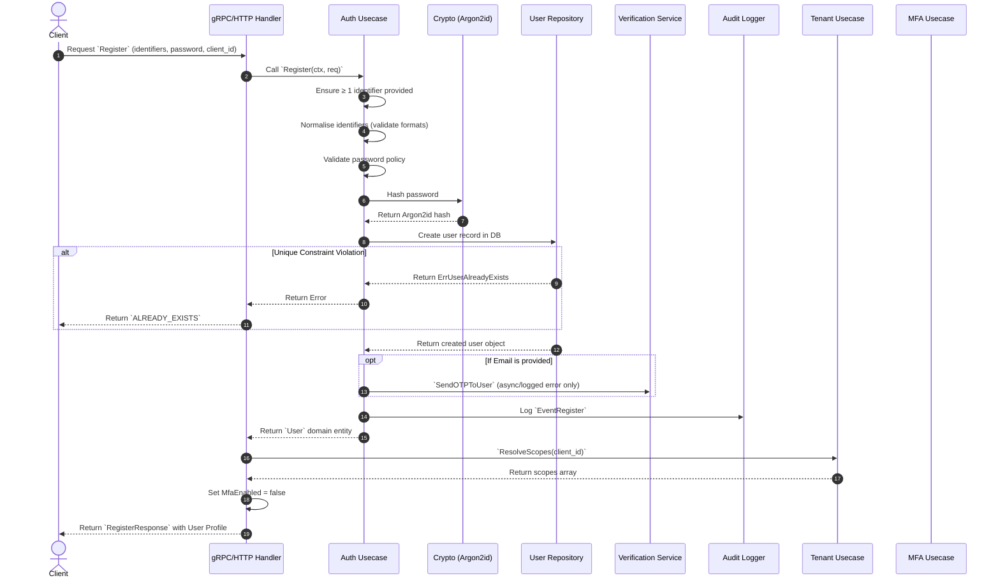

# Register Feature Implementation

## 1. Overview
The `Register` feature is the entry point for onboarding a new user into the core-auth system. It supports registering by email, username, or phone number, along with a password. It validates credentials, strictly applies password policies, securely hashes the password using Argon2id, and provisions the initial unverified user identity. Background processes such as sending an OTP verification email and creating audit trails are also fired during this lifecycle.

### Sequence Diagram


---

## 2. Prerequisites

### Database Schema
The registration feature expects the `users` table to exist and relies heavily on a `UNIQUE` constraint over the identification fields (email, username, phone).
| Field | Type | Attributes | Purpose / Why it is used |
|---|---|---|---|
| `id` | `UUID` | `PRIMARY KEY`, `gen_random_uuid()` | Uniquely identifies the user across the system. We use UUIDs rather than sequential integers to prevent predictability and user enumeration vulnerabilities. |
| `email` | `VARCHAR(255)`| `UNIQUE` | Primary user identifier for login, and destination for account recovery / OTP emails. Must be globally unique to prevent account hijacking. |
| `username` | `VARCHAR(100)`| `UNIQUE` | Alternative public-facing identifier for login. Supports systems where users prefer pseudonyms over structured emails. |
| `phone` | `VARCHAR(30)` | `UNIQUE` | Alternative identifier for login or SMS/WhatsApp based OTP verification routing. Must be globally unique across the service. |
| `password_hash` | `VARCHAR(255)`| `NOT NULL` | Mathematically stores the mathematically protected Argon2id derived hash-string. Essential to ensure that plain-text passwords cannot be reversed by attackers. |
| `role` | `VARCHAR(50)` | Default: `'user'` | Basic RBAC identifier delineating authorization levels. During registration, this is rigidly hardcoded to `'user'` to statically prevent user privilege escalation. |
| `status` | `VARCHAR(50)` | Default: `'unverified'`| Tracks the account lifecycle (`unverified`, `active`, `suspended`, `deleted`). Newly registered users are walled off as `'unverified'` until successful OTP validation. |
| `email_verified_at`| `TIMESTAMPTZ` | | Records the exact chronological time an email OTP was confirmed, proving concrete ownership of the linked email realistically. |
| `phone_verified_at`| `TIMESTAMPTZ` | | Records the exact chronological time a phone OTP was confirmed, proving concrete mathematical ownership of the linked phone device. |
| `created_at` | `TIMESTAMPTZ` | Default: `NOW()` | System audit field securely recording the absolute time the account registration succeeded. |
| `updated_at` | `TIMESTAMPTZ` | Default: `NOW()` | System audit field marking the latest state mutation time (invaluable for cache flushing or syncing systems). |
| `deleted_at` | `TIMESTAMPTZ` | | Used specifically for soft-deletes. If populated, the system treats the account as fully void for logins, preserving critical relational data while severing access vectors. |

### Dependencies
To implement this feature in your target language, ensure you have the following types of libraries available:
| Dependency Focus | Purpose |
|---|---|
| **Argon2id Library** | Essential for securely hashing user passwords before storage. Ensure the library explicitly supports the `argon2id` variant (rather than just `argon2i` or `argon2d`). |
| **PostgreSQL Driver / ORM** | Used to connect to the database, execute parameterized inserts, map UUIDs, and properly catch and handle unique constraint validation errors natively (e.g., `SQLSTATE 23505`). |
| **Transactional Email Client** | An HTTP client or provider SDK (like Resend, SendGrid, AWS SES) needed to fire off the onboarding OTP email asynchronously. |

### Config Environment Variables
Although not directly consumed by the `Register` handler, supporting services depend on these:
- `RESEND_API_KEY`: Required by the Verification Service to send the onboarding OTP email.
- PostgreSQL Config parameters (e.g., `DATABASE_URL`) to access the `users` table.

### Cryptographic Requirements
- **Argon2id:** All incoming passwords must be securely hashed prior to storage utilizing Argon2id.
  - Required Algorithm: `argon2id`
  - Memory: `64 MB (65536 KiB)` minimum
  - Iterations: `1` minimum
  - Parallelism: `4` (should match core-count config)
  - Result format: Standard PHC string format `$argon2id$v=19$m=...`

---

## 3. Contracts

### 3.1 gRPC Contract Specification
Defined in `auth/v1/auth.proto` and `auth/v1/shared.proto`.

**Request:**
```protobuf
message RegisterRequest {
  string client_id = 1; // Required. Identifies the specific tenant or application accessing the server.
  
  // At least ONE identity mechanism is strictly required. 
  string email    = 2;  // The user's main email address.
  string username = 3;  // An alternative public-facing pseudonym.
  string phone    = 4;  // E.164 strictly validated format, e.g. +628123456789

  string password = 5;  // Required. The raw, plain-text password to hash.
}
```

**Response Elements:**
The response heavily leverages nested shared elements natively from `shared.proto`. 

```protobuf
message RegisterResponse {
  UserProfile user   = 1;
  TokenPair   tokens = 2; // Warning: Tokens are currently omitted (nil) on Registration requiring users to re-auth manually.
}
```

Here is a breakdown of the nested fields utilized:
- **`UserProfile`:** A safe external view of the domain user, omitting sensitive fields like `password_hash`.
  - `user_id`: The raw UUID identifier.
  - `email` / `username` / `phone`: The identifiers bound to the account.
  - `role`: Static RBAC scope (default `"user"`).
  - `scopes`: Client-specific OAuth-style capability list (resolved against the given `client_id`).
  - `email_verified` / `phone_verified`: Booleans dictating if ownership of the respective pipelines have been securely confirmed.
  - `mfa_enabled`: Always `false` during Registration.

- **`TokenPair`:** Standardized token envelope format.
  - `access_token`: The JWT passed in Authorization headers later.
  - `refresh_token`: Opaque string hash (non-JWT) utilized to fetch new access tokens without repeating passwords.
  - `expires_in`: The lifespan of the access_token in explicit seconds.

---

### 3.2 HTTP REST / JSON Gateway Contract
Via grpc-gateway metadata, the exact identical functionality is simultaneously exposed via pure HTTP/JSON for web clients.

**Endpoint:** `POST /v1/auth/register`
**Content-Type:** `application/json`

**Sample Request Body:**
```json
{
  "client_id": "test-app",
  "email": "user@example.com",
  "password": "SecurePassword123!"
}
```

**Sample Response Body (200 OK):**
```json
{
  "user": {
    "user_id": "40bf857f-d513-402a-a92c-f6fa9b422a55",
    "email": "user@example.com",
    "username": "",
    "phone": "",
    "role": "user",
    "scopes": ["openid", "profile"],
    "email_verified": false,
    "phone_verified": false,
    "mfa_enabled": false
  },
  "tokens": null
}
```

---

### 3.3 Expected Error States
Whether interacting over gRPC or HTTP, errors map to standard `google.rpc.Status` codes and internal string identifiers:
- `ALREADY_EXISTS / user_already_exists`: Fired identically if the email, username, or phone already clashes in the database.
- `INVALID_ARGUMENT / password_policy_violation`: Sent if the specified password string fails complexity analysis.
- `INVALID_ARGUMENT / invalid_identifier_format`: Rejected fundamentally if the format of the email (RegEx) or Phone (E.164 length/country code) fails.

---

## 4. Implementation Step-by-Step Guide

### Step 1: Input Validation & Normalisation
Validate input requirements inside the Auth Usecase constraint layer explicitly BEFORE doing anything else to prevent malformed data from reaching the core cryptographic or database layers.

1. **Identifier Core Check**: Ensure at least one primary identifier is present. If `Email`, `Username`, and `Phone` are all empty, immediately reject with `ErrInvalidIdentifier`.

2. **Email Normalisation & Validation**: (When provided)
   - Trim all leading/trailing whitespace natively.
   - Convert the entire string to localized lowercase.
   - Run against a standard RFC-5321 Regex pattern: `^[a-zA-Z0-9._%+-]+@[a-zA-Z0-9.-]+\.[a-zA-Z]{2,}$`.
   - *Failure:* Return `invalid_identifier_format`.

3. **Username Validation**: (When provided)
   - Trim leading/trailing whitespace.
   - Enforce character boundaries using regex: `^[a-zA-Z0-9_.]{3,64}$`
   - **Explicit constraints:** Must be exactly between 3 and 64 characters long. Can only consist of English alphabet letters, digits (`0-9`), underscores (`_`), and dots (`.`).
   - Note: The original casing is intentionally preserved for display purposes, but the Postgres DB index independently ensures case-insensitive uniqueness.
   - *Failure:* Return `invalid_identifier_format`.

4. **Phone Normalisation & Validation**: (When provided)
   - Sanitize by stripping all extraneous characters commonly entered by users: explicitly remove spaces ` `, dashes `-`, and parentheses `(` `)`.
   - Validate against the strict international **E.164 standard format** using regex: `^\+[1-9]\d{6,14}$` (Must strictly start with a `+`, followed by a non-zero country code integer, and then 6-14 numerical digits).
   - *Failure:* Return `invalid_identifier_format`.

5. **Strict Password Policy Engine**:
   - Calculate the exact UTF-8 rune character length.
   - **Min Length Check**: Must be $\ge$ 8 characters.
   - **Max Length Check**: Must be $\le$ 128 characters (Crucial for preventing excessively long hashing DOS attacks down the pipeline).
   - **Complexity Enforcing Layer**: Programmatically iterate through the entire string to mathematically verify it contains:
     - At least *one* Uppercase character (`A-Z`).
     - At least *one* Lowercase character (`a-z`).
     - At least *one* Numerical digit (`0-9`).
   - *Failure:* Return `password_policy_violation` detailing the explicit failed complexity bound.

### Step 2: Establish Default Entity Properties
Create the initial user structure for tracking:
- **Role:** Hardcoded strictly to `"user"`.
- **Status:** Hardcoded strictly to `"unverified"`.

### Step 3: Password Hashing
Convert the validated plaintext password using the mathematically hard Argon2id algorithm to protect against database leaks.
1. **Salt Generation**:
   - Securely generate an entirely random 16-byte salt natively using a cryptographically secure pseudo-random number generator (CSPRNG) like `crypto/rand`.
   - *Why?* This ensures that if two users happen to choose the exact same password (e.g., "password123"), their final stored hashes will look entirely different, completely defeating pre-computed Rainbow Table attacks.
2. **Argon2id Computation**:
   - Allocate the required strict memory footprint (64 MiB / `65536 KiB`), set iterations (`t=1`), and declare parallelism threads (`p=4`). 
   - Feed the plaintext password string and the generated salt into the `Argon2id` derivation function to crunch the mathematical payload. This operation forces the CPU memory and time consumption intentionally to drastically slow down brute-force attackers.
3. **PHC String Construction**:
   - Encode both the raw binary salt and the resultant raw binary hash into safe printable text using `Base64` (Raw standard encoding, omitting padding).
   - Format everything into the standardized PHC string format so that the tuning parameters are bound indefinitely to this specific user's hash.
   - Result shape: `$argon2id$v=19$m=65536,t=1,p=4$<base64-salt>$<base64-hash>`
4. **State Cleanup**:
   - Save this highly secure PHC string locally onto the `User` struct's `password_hash` property.
   - **Crucial:** Immediately discard the plaintext password from memory. It should never be logged or persisted anywhere.

### Step 4: Persist User (Database Call)
Fire the created structure to the domain repository.
- Attempt an `INSERT INTO users` mapped query.
- Use `RETURNING id, created_at, updated_at` to capture DB-managed properties.
- Catch unique constraint violation exceptions heavily (`SQLSTATE 23505`) which denotes overlapping emails/usernames/phones. Map this safely to `ErrUserAlreadyExists`.

### Step 5: Trigger Asynchronous Delivery Workflows
If the new user provided an email address logic pathway:
- Trigger the `VerificationService.SendOTPToUser` async boundary giving the explicit newly generated `User.ID` and `Email` string.
- Crucial Note: Check internally, if this sending fails, log it immediately natively (`slog.Error`), but DO NOT halt or fail the registration workflow (The user request can succeed and they can manually request another OTP).

### Step 6: Log Audit Trail
Commit a security event to track system creation metadata across the scope:
- Push `audit.EventRegister` tied dynamically to the newly acquired `user.ID` via `AuditLogger`.

### Step 7: Delivery Composition & Output
Back in the transport layer (gRPC/HTTP Delivery scope), build the presentation shape of the profile:
- Take the raw User domain entity and convert it to its `UserProfile` protobuf map.
- Cross-call `TenantUseCase.ResolveScopes` to fetch and embed dynamic permission scopes matching the active `client_id`.
- Hardcode the returned `MfaEnabled` property to `false`, as a newly registered user cannot possibly have completed the out-of-band MFA enrollment setup, entirely eliminating an unnecessary query.
- Formulate the finalized `RegisterResponse` enveloping the `UserProfile` data and send it identically wrapped with an OK layout state standard to the requester.
