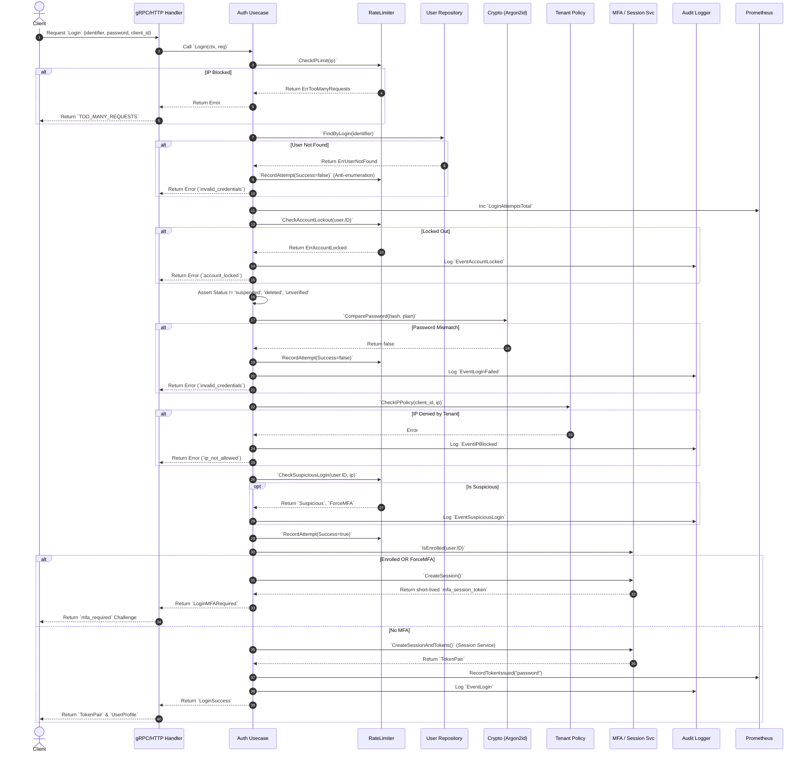

# Login Feature Implementation

## 1. Overview
The `Login` feature is the central authentication gateway for the `core-auth` system. It securely verifies user credentials (email, username, or phone against a password) while enforcing an extensive array of security gates including rate limiting, account lockouts, tenant-level IP allowlisting, suspicious login detection, and Multi-Factor Authentication (MFA) challenges. 

### Sequence Diagram


---

## 2. Prerequisites

### Database Schema
#### 1. `users` Table
The login feature relies fundamentally on the primary entities initialized during registration.
| Field | Type | Purpose / Why it is used |
|---|---|---|
| `id` | `UUID` | Used as the primary key and authoritative reference for logging attempts, triggering lockouts, and issuing tokens. |
| `status` | `VARCHAR` | Evaluated strictly prior to password verification (`unverified`, `suspended`, `deleted`). Prevents login entirely if the account is not active. |
| `password_hash` | `VARCHAR` | Used as the cryptographic anchor to compare the mathematically crunched plaintext password. |
| `role` | `VARCHAR` | Read from the DB and injected actively into the final JSON Web Token upon a completely successful login sequence. |

#### 2. `login_attempts` Table
The system natively stores permanent history of every login interaction to power long-term Suspicious Login detection (rather than relying purely on ephemeral Redis limits).
| Field | Type | Attributes | Purpose / Why it is used |
|---|---|---|---|
| `user_id` | `UUID` | `NULLABLE` | Ties the attempt strongly to the domain user. If an attacker inputs an incorrect email causing a "User Not Found" error, this is intentionally saved as `NULL` so an anonymous failure is still registered under their IP without breaking foreign keys. |
| `ip_address`| `INET` | `NOT NULL` | Stored using Postgres's native IP/Network address data type. Allows blazing-fast querying by network mask (e.g. `192.168.0.0/24`) to calculate historical failures or detect Geo-anomalies. |
| `attempted_at`| `TIMESTAMPTZ`| Default: `NOW()` | Records the absolute time of the login. Evaluated heavily against the `SUSPICIOUS_LOGIN_WINDOW` (e.g. 90 days). |
| `success` | `BOOLEAN` | `NOT NULL` | Tracks the conclusion of the attempt. A stream of successive `false` flags triggers timeouts, while a `true` flag automatically clears temporary lockouts. |

### Dependencies
| Dependency Focus | Purpose |
|---|---|
| **Argon2id Library** | Used to securely hash the incoming plaintext password and mathematically compare it against the stored PHC string. |
| **Redis / Cache Store** | Highly recommended for the Rate Limiter (`CheckIPLimit`, `CheckAccountLockout`) to rapidly track failed login attempts globally. |
| **Prometheus** | Metric exporter to track successful and failed login attempts for observability (`LoginAttemptsTotal`, `LoginFailuresTotal`). |

### Rate Limiter & Security Configurations
The Login feature heavily restricts abuse vectors via environment-configurable thresholds explicitly protecting authentication.
| Config Variable | Default | Purpose / Behavior |
|---|---|---|
| `RATE_LIMIT_MAX_FAILED_PER_IP` | `30` | The maximum allowable failed login attempts permitted from a single IP address before a strict IP volumetric block is applied. |
| `RATE_LIMIT_IP_WINDOW` | `15m` | The sliding or fixed memory window during which the `MAX_FAILED_PER_IP` cache counter increments. |
| `RATE_LIMIT_MAX_FAILED_PER_ACCOUNT`| `10` | The absolute maximum failed password attempts targeted at a *single unique user account* before triggering an arbitrary lockout state. |
| `RATE_LIMIT_ACCOUNT_LOCKOUT` | `15m` | The duration an abused user profile is placed in the locked-out state before retrying login is allowed. |
| `SUSPICIOUS_LOGIN_ENABLED` | `true` | Toggles the detection engine looking for radically anomalous metadata (e.g. geographically distant IP structures). |
| `SUSPICIOUS_LOGIN_ACTION` | `audit_only`| Designates the fallback response if an anomaly triggers. Options: `audit_only` (allow access, log trace) or `challenge_mfa` (intercept the pipeline into the TOTP flow). |

### Cryptographic Requirements
- **Argon2id Verification:** Must support parsing the standard PHC string format (e.g., `$argon2id$v=19$m=...`).
- **Timing Attacks Defense:** The database lookup must be obfuscated. If an identifier doesn't exist, the system must return `invalid_credentials` (the same error as a bad password) and record an anonymous failed attempt to thwart user enumeration.

---

## 3. Contracts

### 3.1 gRPC Contract Specification
Defined in `auth/v1/auth.proto`.

**Request:**
```protobuf
message LoginRequest {
  string client_id = 1; // Required. Identifies the tenant for IP policies and tracking.

  // Exactly ONE identifier is required.
  string email    = 2;
  string username = 3;
  string phone    = 4;

  string password = 5; // Required. The raw, plain-text password to verify.
}
```

**Response Elements:**
Uses a `oneof` payload depending on the user's Multi-Factor Authentication (MFA) status.

```protobuf
message LoginResponse {
  oneof result {
    LoginSuccess login_success = 1; // Returned directly if MFA is completely completely bypassed.
    MFARequired  mfa_required  = 2; // Returned if MFA is active or forced, halting token generation.
  }
}

message LoginSuccess {
  UserProfile user   = 1;
  TokenPair   tokens = 2; // Standard JWT access/refresh token envelope.
}

message MFARequired {
  string mfa_session_token = 1; // A short-lived, single-use token to be passed to ChallengeMFA.
  string mfa_type          = 2; // E.g., "totp", "whatsapp".
}
```

### 3.2 HTTP REST / JSON Gateway Contract
Via grpc-gateway metadata.

**Endpoint:** `POST /v1/auth/login`
**Content-Type:** `application/json`

**Sample Request:**
```json
{
  "client_id": "test-app",
  "email": "user@example.com",
  "password": "SecurePassword123!"
}
```

**Sample Response Body (200 OK - No MFA):**
```json
{
  "login_success": {
    "user": {
      "user_id": "40bf857f-d513-402a-a92c-f6fa9b422a55",
      "email": "user@example.com",
      "role": "user"
    },
    "tokens": {
      "access_token": "eyJhb...",
      "refresh_token": "opaque_string...",
      "expires_in": 3600
    }
  }
}
```

**Sample Response Body (200 OK - MFA Required Challenge):**
```json
{
  "mfa_required": {
    "mfa_session_token": "short-lived-uuid...",
    "mfa_type": "totp"
  }
}
```

### 3.3 Expected Error States
- `UNAUTHENTICATED / invalid_credentials`: Bad password, or user doesn't exist.
- `FAILED_PRECONDITION / account_not_verified`: User registered but never completed email/phone verification.
- `PERMISSION_DENIED / account_suspended`: Account manually suspended by admin.
- `PERMISSION_DENIED / account_deleted`: Soft-deleted account.
- `RESOURCE_EXHAUSTED / too_many_requests`: IP hit the global login endpoint limit.
- `PERMISSION_DENIED / account_locked`: Standard brute-force protection trigger (e.g., >5 failed attempts).
- `PERMISSION_DENIED / ip_not_allowed`: Tenant explicitly blocked this origin IP.

---

## 4. Implementation Step-by-Step Guide

### Step 1: Pre-Validation & IP Rate Limiting
The extremely first logic executed—before hitting the main database table to query the user—is checking the IP threshold limit. This design explicitly blocks timing-based user enumeration attacks and neutralizes volumetric brute-force scripts (e.g. credential stuffing).

1. **Extract IP Origin:** Extract the true originating client IP securely from the gRPC/HTTP context metadata (e.g., reading through trusted proxies via headers like `X-Forwarded-For`, or peeling the raw network TCP socket IP natively).
2. **Execute Global IP Check (`CheckIPLimit`):**
   - **Bypass Check**: If the parsed IP resolves natively to an empty string (which routinely happens during internal service-to-service gRPC calls), silently bypass the check entirely.
   - **Calculate Temporal Bounds**: Subtract the configured environment delay `RATE_LIMIT_IP_WINDOW` (e.g. `15m`) from the exact current system time to generate a strict lookup `since` chronomarker.
   - **Count Historical Failures**: Ask the repository layer to `CountFailedByIP`. This fires a `COUNT(*)` query tracking exclusively where `ip_address == current IP`, `success == false`, and the recorded `attempted_at >= since`.
   - **Implement "Fail Open" Strategy**: If the query errors out (e.g. Redis timeouts or DB connectivity blips), intentionally swallow the error and allow the sequence to continue bypassing the limit check. We strongly prioritize critical authentication availability over enforcing perfect brute-force rate defenses in degraded states.
   - **Threshold Enforcing**: If the calculated `count` meets or explicitly exceeds `RATE_LIMIT_MAX_FAILED_PER_IP`, abort the complete request immediately and fire the standard HTTP 429 or gRPC `RESOURCE_EXHAUSTED` (`too_many_requests`) network error natively back to the Client.
3. **Identifier Normalization:**
   - Detect mathematically which identifier (email, username, or phone) the client populated.
   - Process the chosen identifier through localized lowercase trimming, preparing it precisely for the upcoming case-sensitive lookup.

### Step 2: Safe Account Lookup (Anti-Enumeration)
Attempt to fetch the user by the parsed identifier from the database.
- *If Not Found (`ErrUserNotFound`):* Do not tell the client. Instead, fire `RateLimiter.RecordAttempt(UserID="", Success=false)` and return a generic `invalid_credentials` error.

### Step 3: Lifecycle Security Gates
Increment `LoginAttemptsTotal` metrics for observability tracing, then enforce account status rules:
1. **Account Lockout:** Run `CheckAccountLockout(user.ID)`. If locked from too many previous bad passwords, log an audit event (`EventAccountLocked`), increment failure metrics, and reject.
2. **Account Status:** Explicitly reject if `Status` is `"suspended"`, `"deleted"`, or `"unverified"`. Only `"active"` profiles can proceed.

### Step 4: Cryptographic Password Verification
Verify the incoming plaintext password dynamically against the user's stored PHC formatted `$argon2id$` string. This requires an intentional reverse-derivation rather than a standard equality check.

1. **Parse the Standard PHC String Format:**
   - Take the user's fetched DB `password_hash` string and break it apart by its `$` delimiters into exactly 6 distinct segments.
   - Enforce strictly that the specific algorithm parsed is literally `argon2id`. 
2. **Version Evaluation Analysis:**
   - Scan and retrieve the version declaration natively (`v=19`).
   - Abort natively if the linked cryptography library fails to support this specific algorithm version.
3. **Parameter Restoration:**
   - Extremely carefully extract out the literal integer values mapping exactly to `m` (Memory constraints in KiB), `t` (Time iteration rounds), and `p` (Parallelism threaded limits) that were historically used identically to build *this* specific hash.
   - *Why?* This heavily guarantees forward-compatibility. If backend defaults natively bump to stricter memory payloads locally next year, older users with weaker historically configured hashes will still efficiently log in because the system dynamically re-reads their exact unique tuning variables.
4. **Base64 Decode Phase:**
   - Safely Base64-decode (Raw Standard Encoding natively omitting padding) the historically extracted salt and the extracted stored hash byte strings separately back entirely into natively usable raw binary byte formats.
5. **Re-Hashing Mathematical Computation:**
   - Take the brand new incoming plain-text password from the user requesting access.
   - Mix it dynamically with their newly extracted original raw byte `salt`.
   - Run the engine forcefully natively through the strict `Argon2id` derivation logic again utilizing exactly their historically reconstructed memory (`m`), time (`t`), and thread limit (`p`) boundaries to safely generate a matching `computed` binary sequence exactly the same byte size limit.
6. **Constant-Time Comparison Evaluation (*CRITICAL*):**
   - Strictly contrast the freshly generated computed binary securely against the mathematically original raw binary byte hash natively inside a rigorous **Constant-Time Compare** function (e.g., `crypto/subtle`).
   - **Do NOT** map this natively against a standard string `==` equality clause. Standard logic engines evaluate explicitly natively returning `false` on the exact microscopic millisecond index a bad letter fails. Advanced attackers easily write scripts globally tracking computation response speeds natively millisecond-by-millisecond to derivatively calculate character structures breaching passwords systemically—widely recognized as a **Timing-Attack**. Constant-time mathematical evaluators uniformly take identical durations regardless of malformed structure shapes, effectively neutralizing those attacks simultaneously.
7. **Handle Validation Failure Event States:**
   - *If securely evaluated to Mismatch:*
     - Immediately invoke `RateLimiter.RecordAttempt(Success=false)` tying identically the verified failure solely towards this explicit `user.ID`.
     - Dispatch Prometheus telemetry natively bumping exactly the bound metric securely tracking `LoginFailuresTotal`.
     - Deposit system historical audit traces bounding natively into the `EventLoginFailed` block.
     - Fallback entirely gracefully returning the unspecific string `invalid_credentials` intentionally obfuscating exact diagnostic state bounds to the user locally.

### Step 5: Advanced Business Policy Validations
*Rules run precisely before marking the attempt as successful!*
1. **Tenant IP Restrictions:** Execute `TenantPolicy.CheckIPPolicy`. If the specific `client_id` denies the origin IP, log `EventIPBlocked`, bump failure metrics, and reject immediately with `ip_not_allowed`.
2. **Suspicious Login Detection:** Evaluate contextual anomalies (like geo-velocity or completely new device IPs). Execute `CheckSuspiciousLogin(user.ID, ip)`.
   - If anomalous: Log `EventSuspiciousLogin`. The engine may instruct to `ForceMFA` for this session.

### Step 6: Finalize Record Success
Call `RateLimiter.RecordAttempt(Success=true)` to officially clear the user's brute-force failure counters in the cache engine.

### Step 7: The MFA & Token Forks
1. **Evaluate MFA Needs:** 
   - Ask `MFAProvider.IsEnrolled(user.ID)`.
   - Combine securely with the explicit `ForceMFA` flag parsed natively from Step 5.
2. **If MFA is Needed:**
   - **Halt Token Generation:** Immediately halt the generic login resolution path. Do not issue any JWTs.
   - **Bind Context State:** Construct an ephemeral `MFASessionData` struct rigorously packing the `UserID`, `ClientID`, and requested `Role` corresponding to this specific, authenticated, but unclarified login trace.
   - **Provsion Ephemeral Store (`CreateSession`):** Delegate natively to the `MFAService` which contacts the `Redis` cache store. The store natively generates a cryptographically random, high-entropy reference string (the `mfa_session_token`) and maps it as the exact key to the JSON-serialized struct payload.
   - **Bind TTL Constraints:** Ensure the cache natively enforces a strict, short-lived Redis TTL boundary (typically 5 to 10 minutes) natively killing dangling incomplete login attempts automatically.
   - **Challenge Response:** Package the generated short-lived raw reference token string alongside the explicitly identified `mfa_type` (e.g. `totp`) natively into the bounded `LoginMFARequired` wrapper and respond immediately directly back to the active client.
3. **If NO MFA Needed:**
   - Execute an `EventLogin` trace in the audit log, and explicitly export the `RecordTokenIssued("password")` infrastructure metric.
   - **Delegate to `SessionService.CreateSessionAndTokens`**:
     - **Resolve Tenant Configurations**: Query the explicit `TenantConfig` mapping exclusively to the `client_id` dynamically overriding native `AccessTokenTTL`, `RefreshTokenTTL`, and `Scopes` logic bounds (failing back securely to global configurations if omitted).
     - **Sign Access Token (JWT)**: Construct a rigid RS256 JSON Web Token explicitly allocating the `sub` (UserID), `role`, `scopes`, the TTL deadline (`exp`), and securely allocating a random native 16-byte `jti` identifier essential for explicit token blacklisting.
     - **Mint Refresh Token**: Run `crypto/rand.Read` generating 32 opaque bytes completely natively. Hex-encode it into a strict 64-character string acting identically as the raw client-facing refresh token.
     - **Hash Refresh Token**: Take the raw client refresh token text, and compute natively its structural `SHA-256` hash encoding.
     - **Persist Database Session**: Create an authoritative `sessions` table record formally tying together the explicit User ID, Client ID, Metadata (IP, User-Agent natively from context), expiration constraints explicit to `refreshTTL`, and securely saving exclusively the **hashed** refresh string (completely preventing stolen session tokens from raw database leaks natively).
   - Construct the ultimate `LoginSuccess` representation utilizing the pristine User Domain shape enveloping identically the newly natively securely minted `TokenPair`.
